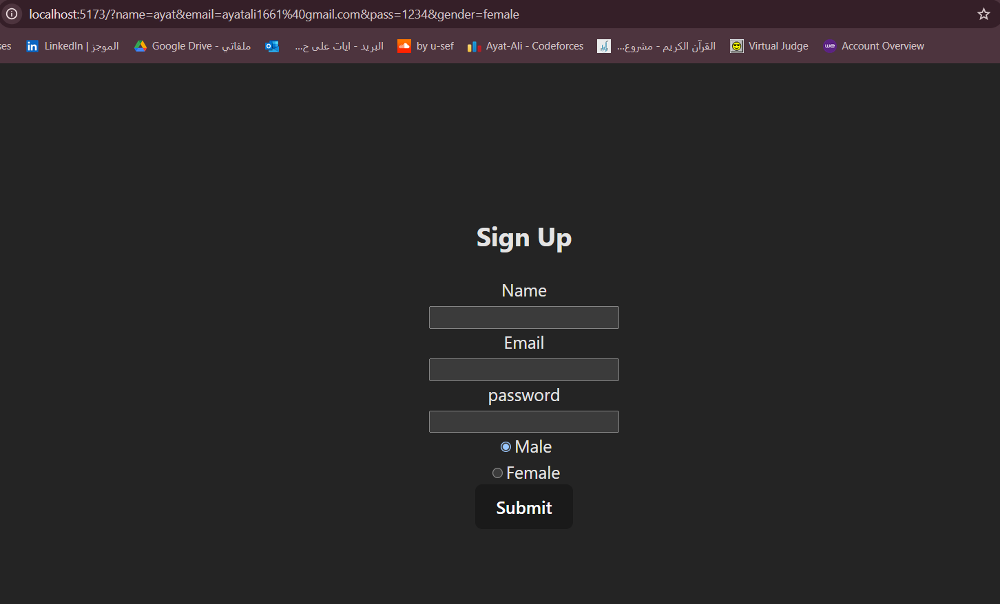

# Simple Sign-Up Form Using React  

This project is a basic sign-up form built using React. The source code is in `src/App.jsx`.

## Screenshot  
  

## Features  
- Name, email, and password fields  
- Gender selection using radio buttons  
- Styled using CSS classes  

## Installation & Usage  
1. Clone this repository:  
   ```sh
   git clone https://github.com/Ayat166/React-Day1.git
   cd React-Day1
   ```
2. Install dependencies:  
   ```sh
   npm install
   ```
3. Start the development server:  
   ```sh
   npm run dev
   ```

## File Structure  
```
my-app/
│── public/
│   ├── image.png   # Screenshot used in README
│── src/
│   ├── App.jsx     # Main application file
│   ├── App.css     # Styling for the form
│   ├── main.jsx    # Entry point
│── package.json
│── README.md
```

## License  
This project is open-source and available under the MIT License.

